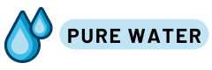
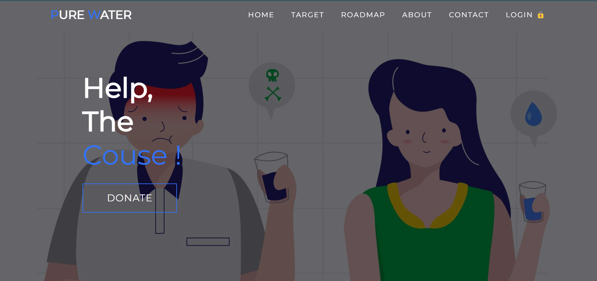

# <b>Pure Water </b>
<div align="center">
  <a href="./img/logo.png">
    
  </a>
</div>


<a href="http://purewater.42web.io/">


> This is a crowdfunding platform & the website for achive the SDG Goal 6 (Clean water and sanitation).  

### 🪰 Adjustments and improvements

The project is still under development and the next updates will focus on the following tasks:

- [x] Simple UI ✅
- [x] Php login system ✅
- [x] Backend creation (CRUD - ✅)
- [x] User interface Design (Frontend ✅)
- [x] Js powerd form ✅
- [x] Paypal donation integration ✅
- [ ] Much detailed website
- [ ] Login & sign up form improvements
- [ ] User dashboard redesign
- [ ] Easy donation and detailed donation data
- [ ] And many more...

## 📁 File structure 
<details>
<summary><b>File structure</b></summary>
<br>

   - [README.md](README.md)
   - __backend__
     - [auth\_session.php](backend/auth_session.php)
     - [dashboard.php](backend/dashboard.php)
     - [db.php](backend/db.php)
     - [index.php](backend/index.php)
     - [login.php](backend/login.php)
     - [logout.php](backend/logout.php)
     - [registration.php](backend/registration.php)
     - [style.css](backend/style.css)
   - __css__
     - [headers.css](css/headers.css)
     - [proinfo.css](css/proinfo.css)
     - [signup.css](css/signup.css)
     - [style.css](css/style.css)
     - [w3s.css](css/w3s.css)
   - __img__
     - [1.jpg](img/1.jpg)
     - __Target__
       - [6.1.svg](img/Target/6.1.svg)
       - [6.2.svg](img/Target/6.2.svg)
       - [6.3.svg](img/Target/6.3.svg)
       - [6.4.svg](img/Target/6.4.svg)
       - [6.5.svg](img/Target/6.5.svg)
       - [6.6.svg](img/Target/6.6.svg)
       - [6.7.svg](img/Target/6.7.svg)
       - [6.8.svg](img/Target/6.8.svg)
       - [GOAL\_6\_TARGET\_6.1.png](img/Target/GOAL_6_TARGET_6.1.png)
       - [GOAL\_6\_TARGET\_6.2.png](img/Target/GOAL_6_TARGET_6.2.png)
       - [GOAL\_6\_TARGET\_6.3.png](img/Target/GOAL_6_TARGET_6.3.png)
       - [GOAL\_6\_TARGET\_6.4.png](img/Target/GOAL_6_TARGET_6.4.png)
       - [GOAL\_6\_TARGET\_6.5.png](img/Target/GOAL_6_TARGET_6.5.png)
       - [GOAL\_6\_TARGET\_6.6.png](img/Target/GOAL_6_TARGET_6.6.png)
       - [GOAL\_6\_TARGET\_6.A.png](img/Target/GOAL_6_TARGET_6.A.png)
       - [GOAL\_6\_TARGET\_6.B.png](img/Target/GOAL_6_TARGET_6.B.png)
       - __goal\-6__
         - __GOAL\_6\_PRIMARY\_ICON__
           - __GOAL\_6\_EPS__
             - [TheGlobalGoals\_Icons\_Black\_Goal\_6.eps](img/Target/goal-6/GOAL_6_PRIMARY_ICON/GOAL_6_EPS/TheGlobalGoals_Icons_Black_Goal_6.eps)
             - [TheGlobalGoals\_Icons\_Color\_Goal\_6.eps](img/Target/goal-6/GOAL_6_PRIMARY_ICON/GOAL_6_EPS/TheGlobalGoals_Icons_Color_Goal_6.eps)
           - __GOAL\_6\_PNG__
             - [TheGlobalGoals\_Icons\_Black\_Goal\_6.png](img/Target/goal-6/GOAL_6_PRIMARY_ICON/GOAL_6_PNG/TheGlobalGoals_Icons_Black_Goal_6.png)
             - [TheGlobalGoals\_Icons\_Color\_Goal\_6.png](img/Target/goal-6/GOAL_6_PRIMARY_ICON/GOAL_6_PNG/TheGlobalGoals_Icons_Color_Goal_6.png)
           - __GOAL\_6\_SVG__
             - [TheGlobalGoals\_Icons\_Black\_Goal\_6.svg](img/Target/goal-6/GOAL_6_PRIMARY_ICON/GOAL_6_SVG/TheGlobalGoals_Icons_Black_Goal_6.svg)
             - [TheGlobalGoals\_Icons\_Color\_Goal\_6.svg](img/Target/goal-6/GOAL_6_PRIMARY_ICON/GOAL_6_SVG/TheGlobalGoals_Icons_Color_Goal_6.svg)
         - __GOAL\_6\_TARGETS__
           - __GOAL\_6\_TARGETS\_EPS__
             - [GOAL\_6\_TARGET\_6.1.eps](img/Target/goal-6/GOAL_6_TARGETS/GOAL_6_TARGETS_EPS/GOAL_6_TARGET_6.1.eps)
             - [GOAL\_6\_TARGET\_6.2.eps](img/Target/goal-6/GOAL_6_TARGETS/GOAL_6_TARGETS_EPS/GOAL_6_TARGET_6.2.eps)
             - [GOAL\_6\_TARGET\_6.3.eps](img/Target/goal-6/GOAL_6_TARGETS/GOAL_6_TARGETS_EPS/GOAL_6_TARGET_6.3.eps)
             - [GOAL\_6\_TARGET\_6.4.eps](img/Target/goal-6/GOAL_6_TARGETS/GOAL_6_TARGETS_EPS/GOAL_6_TARGET_6.4.eps)
             - [GOAL\_6\_TARGET\_6.5.eps](img/Target/goal-6/GOAL_6_TARGETS/GOAL_6_TARGETS_EPS/GOAL_6_TARGET_6.5.eps)
             - [GOAL\_6\_TARGET\_6.6.eps](img/Target/goal-6/GOAL_6_TARGETS/GOAL_6_TARGETS_EPS/GOAL_6_TARGET_6.6.eps)
             - [GOAL\_6\_TARGET\_6.A.eps](img/Target/goal-6/GOAL_6_TARGETS/GOAL_6_TARGETS_EPS/GOAL_6_TARGET_6.A.eps)
             - [GOAL\_6\_TARGET\_6.B.eps](img/Target/goal-6/GOAL_6_TARGETS/GOAL_6_TARGETS_EPS/GOAL_6_TARGET_6.B.eps)
           - __GOAL\_6\_TARGETS\_PNG__
           - __GOAL\_6\_TARGETS\_SVG__
             - [GOAL\_6\_TARGET\_6.1.svg](img/Target/goal-6/GOAL_6_TARGETS/GOAL_6_TARGETS_SVG/GOAL_6_TARGET_6.1.svg)
             - [GOAL\_6\_TARGET\_6.2.svg](img/Target/goal-6/GOAL_6_TARGETS/GOAL_6_TARGETS_SVG/GOAL_6_TARGET_6.2.svg)
             - [GOAL\_6\_TARGET\_6.3.svg](img/Target/goal-6/GOAL_6_TARGETS/GOAL_6_TARGETS_SVG/GOAL_6_TARGET_6.3.svg)
             - [GOAL\_6\_TARGET\_6.4.svg](img/Target/goal-6/GOAL_6_TARGETS/GOAL_6_TARGETS_SVG/GOAL_6_TARGET_6.4.svg)
             - [GOAL\_6\_TARGET\_6.5.svg](img/Target/goal-6/GOAL_6_TARGETS/GOAL_6_TARGETS_SVG/GOAL_6_TARGET_6.5.svg)
             - [GOAL\_6\_TARGET\_6.6.svg](img/Target/goal-6/GOAL_6_TARGETS/GOAL_6_TARGETS_SVG/GOAL_6_TARGET_6.6.svg)
             - [GOAL\_6\_TARGET\_6.A.svg](img/Target/goal-6/GOAL_6_TARGETS/GOAL_6_TARGETS_SVG/GOAL_6_TARGET_6.A.svg)
             - [GOAL\_6\_TARGET\_6.B.svg](img/Target/goal-6/GOAL_6_TARGETS/GOAL_6_TARGETS_SVG/GOAL_6_TARGET_6.B.svg)
     - [WASH SDG.png](img/WASH%20SDG.png)
     - __Work__
       - [1.jpg](img/Work/1.jpg)
       - [2.jpg](img/Work/2.jpg)
       - [3.jpg](img/Work/3.jpg)
       - [4.jpg](img/Work/4.jpg)
       - [5.jpg](img/Work/5.jpg)
       - [6.jpeg](img/Work/6.jpeg)
       - [7.jpg](img/Work/7.jpg)
       - [8.jpg](img/Work/8.jpg)
       - [9.jpg](img/Work/9.jpg)
       - [water resources management.jpg](img/Work/water%20resources%20management.jpg)
       - [water\-related ecosystems.jpg](img/Work/water-related%20ecosystems.jpg)
     - [cleanwater.png](img/cleanwater.png)
     - [donate.jpg](img/donate.jpg)
     - [home.jpg](img/home.jpg)
     - [home.svg](img/home.svg)
     - [logo.png](img/logo.png)
     - [sanitation.jpg](img/sanitation.jpg)
     - [water1.png](img/water1.png)
   - [index.html](index.html)
   - __js__
     - [app.js](js/app.js)
   - [list.md](list.md)
   - [proinfo.html](proinfo.html)

</details>


## 🚀 Demo <b>Pure Water </b>

To check <b>Pure Water </b>, follow these steps:

* Click the link below 
* use these credentials to login

login credentials:

#<a href="http://purewater.42web.io/">Pure Water</a> 
```
User - ?
password - ?

Just create new account and check how it works. <register>
```


## ⚙️ Database <b>Pure Water </b>

Sql data structure:

```
<example>
```


## 📫 Contributing to <b>Pure Water </b>
<!---If your README is long or if you have any specific process or steps you want contributors to follow, consider creating a separate CONTRIBUTING.md file--->
To contribute to <b>Pure Water </b>, follow these steps:

1. Fork this repository.
2. Create a branch: `git checkout -b <branch_name>`.
3. Make your changes and commit them: `git commit -m '<message_commit>'`
4. Push to the original branch: `git push origin <b>Pure Water </b> / <local>`
5. Create the pull request.

Alternatively, see the GitHub documentation at [how to create a pull request](https://help.github.com/en/github/collaborating-with-issues-and-pull-requests/creating-a-pull-request ).

## 🤝 Contributors

We thank the following people who contributed to this project:

<table>
  <tr>
  <td align="center">
      <a href="https://github.com/HMAHD">
        <br>
        <sub>
          <b>Akash Hasendra</b>
        </sub>
      </a>
    </td>
    <td align="center">
      <a href="https://github.com/kaush0024">
        <br>
        <sub>
          <b>Kaushi</b>
        </sub>
      </a>
    </td>
    <td align="center">
      <a href="https://github.com/Pubu00">
        <br>
        <sub>
          <b>Pubudhu</b>
        </sub>
      </a>
    </td>
    <td align="center">
      <a href="https://github.com/Sewwaa">
        <br>
        <sub>
          <b>Sewwaa</b>
        </sub>
      </a>
    </td>
    <td align="center">
      <a href="#">
        <br>
        <sub>
        <b>Sanjeewa Lakmal</b>
        </sub>
      </a>
    </td>
  </tr>
</table>


## 😄 Be one of the contributors<br>

Want to be part of this project? Click [HERE](CONTRIBUTING.md) and read how to contribute.

## 🛠 References & Languages 

- 💻 &nbsp;
  
  
  
  
  
  
- 🌐 &nbsp;
  
  
  
  
  
  

[⬆ Back to top](#project-name)<br>
